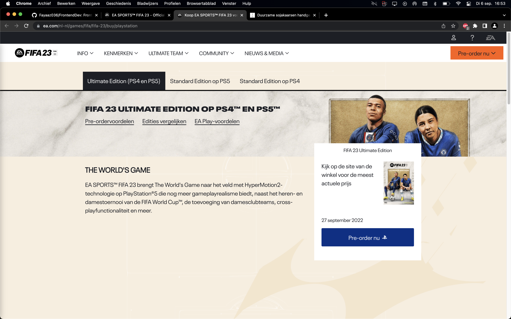
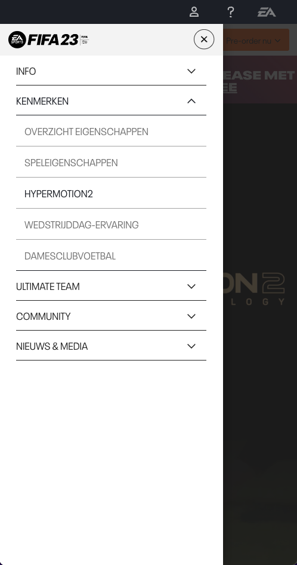
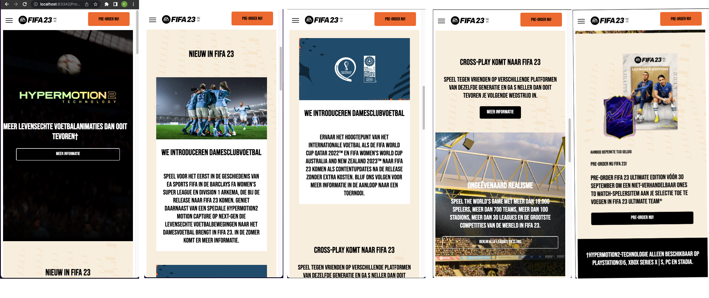
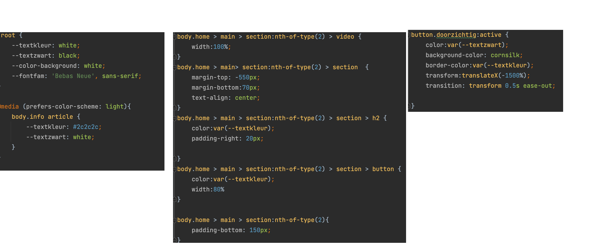
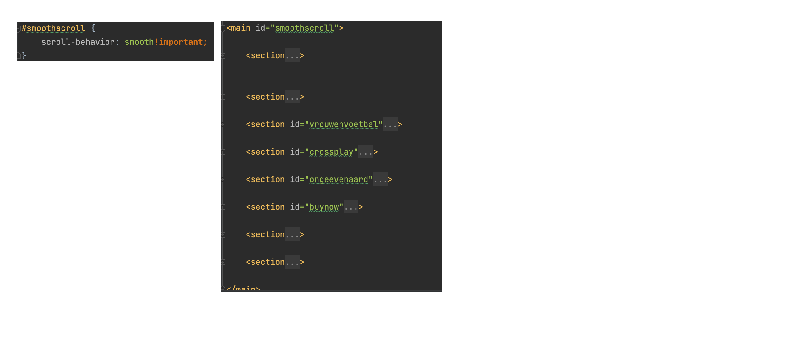
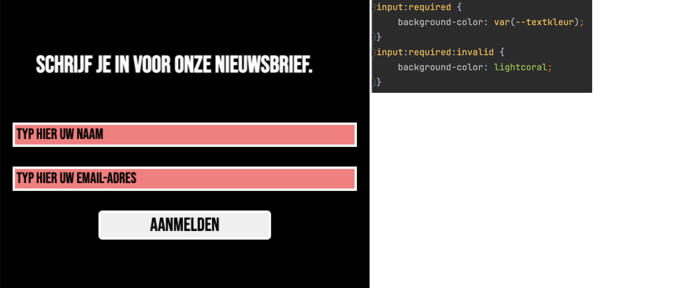

# Procesverslag
Markdown is een simpele manier om HTML te schrijven.  
Markdown cheat cheet: [Hulp bij het schrijven van Markdown](https://github.com/adam-p/markdown-here/wiki/Markdown-Cheatsheet).

Nb. De standaardstructuur en de spartaanse opmaak van de README.md zijn helemaal prima. Het gaat om de inhoud van je procesverslag. Besteedt de tijd voor pracht en praal aan je website.

Nb. Door *open* toe te voegen aan een *details* element kun je deze standaard open zetten. Fijn om dat steeds voor de relevante stuk(ken) te doen.

## Jij

  
uitwerken voor kick-off werkgroep

  ### Auteur:
  Fayaaz Nabie
  #### Je startniveau:
  Rood
  #### Je focus:
  Surface Plain 

## Je website

  
uitwerken voor kick-off werkgroep

  ### Je opdracht:
https://www.ea.com/nl-nl/games/fifa/fifa-23

  #### Screenshot(s) van de eerste pagina (small screen): 
  hier de naam van de pagina  
  

  #### Screenshot(s) van de tweede pagina (small screen):
  hier de naam van de pagina  
  
 

## Toegankelijkheidstest 1/2 (week 1)

  
uitwerken na test in 1e werkgroep

  ### Bevindingen
  Lijst met je bevindingen die in de test naar voren kwamen:

  #### Screenreader
 Alles word eentonig en raar uitgesproken. 
  headers worden als Koptext (Nummer) uitgesproken

  #### Muis en Toetsenbord 
  geen problemen mee, normale navigatie

  #### Motoriek (shocks, elastiekjes)
 Elastiekjes zorgden ervoor dat je multitasker moest uitvoeren als je scrollt
ook is het moeilijk te typen aangezien de kleine toetsen

  #### Visueel (brillen, contrast, kleurenblind, dark/light). 
 De bril met het 'Slecht zien' ofterwel met het kleine gaatje in het midden 
zorge ervoor dat ik een klein stukje van mijn scherm kon zien, en ik regelmatig
mijn muis kwijt raakte. 

## Breakdownschets (week 1)

  
uitwerken na afloop 2e werkgroep

  ### de hele pagina: 
  

  ### dynamisch deel (bijv menu): 
  

  ### wellicht nog een dynamisch deel (bijv filter): 

## Voortgang 1 (week 2)

  
Voorgang week 1

  ### Stand van zaken
Tijdens eerste week heb ik de eerste pagina van de website gemaakt.
Hierbij heb ik de layout nagebouwd en de content gevuld.
Niet alles ging vlekkeloos, maaar goed het werkt (een soort van)

  ### Agenda voor meeting
  samen met je groepje opstellen

  | fayaaz 1                                                       | student 2          | student 3    | student 4        |
----------------------------------------------------------------| ---                | ---          | ---              |
  | blokjes veranderen zonder dat ik zeg dat zij moeten veranderen | en dit             | en ik dit    | en dan ik dat    |
  | section background video?                                      | dit als er tijd is | nog een punt | dit wil ik zeker |
  | ...                                                            | ...                | ...          | ...              |

  ### Verslag van meeting
  hier na afloop snel de uitkomsten van de meeting vastleggen

website per ongeluk op desktop gemaakt. Volgens vasilis beste alles wegooien en opnieuw beginnen met website.

## Voortgang 2 (week 3)

  
uitwerken voor 2e voortgang

  ### Stand van zaken
website omgegooid van desktop naar mobiel (een-koloms)

  ### Agenda voor meeting
  samen met je groepje opstellen

| fayaaz 1                                                            | student 2          | student 3    | student 4        |
---------------------------------------------------------------------| ---                | ---          | ---              |
 de video begint niet uit zichzelf, en soms begint hij helemaal niet | section background video?                                      | dit als er tijd is | nog een punt | dit wil ik zeker |
| navigatie hamburger menu klapt wel uit, maar heeft geen animatie    | ...                | ...          | ...              |

  ### Verslag van meeting
  hier na afloop snel de uitkomsten van de meeting vastleggen

de website was goed volgens de studentassistent (imairo) & anwar heeft mij geholpen met de animatie toevoegen aan de hambugermenu.

## Toegankelijkheidstest 2/2 (week 4)

  
uitwerken na test in 8e werkgroep

  ### Bevindingen
  Lijst met je bevindingen die in de test naar voren kwamen (geef ook aan wat er verbeterd is):

  #### Screenreader
  De screenreader werkte naar behoren, de plaatjes met de Alt texten werden uitgesproken en de text op de website werd foutloos utgesproken.

  #### Muis en Toetsenbord 
  toetsenbord navigatie werkte goed. Tabben door de pagina ging soepel en langs elke button

  #### Motoriek (shocks, elastiekjes)
  met de elastiekjes was de website prima navigeerbaar. 

  #### Visueel (brillen, contrast, kleurenblind, dark/light). 
  de kleuren op de website konden goed onderscheiden worden tijdens de verschillende filterbrillen die we hebben gebruikt. alleen niet helemaal leebaas mer een slechtziende bril. bij inzoomen werd alles wel duidelijker

## Voortgang 3 (week 4)

  
uitwerken voor 3e voortgang

  ### Stand van zaken
  De testen waren succesvol en ik kon me richten op de beginfase van blingbling. de basis van de site was goed, alleen had ik nog een paar probleempjes. 

  ### Agenda voor meeting
  samen met je groepje opstellen

  ik had een paar problemen met de fotos van github die in mijn website stonden.
  

  ### Verslag van meeting
  basis was goed, nu kan ik me richten op e blingbling elementen van de website.
  'button states goed uitgewerkt en maak er wat moois van' ~ Vasilis

## Eindgesprek (week 5)

  
uitwerken voor eindgesprek

  ### Je uitkomst - karakteristiek screenshots:
  
  de website is vrijwel identiek aan de website van Fiaf 23. Alleen omdat de game al uit is, en ik het in de fase van pre-order 
ging maken, is het zo dat de bestaande website veranderd is. 

  ### Dit ging goed/Heb ik geleerd: 
  Korte omschrijving met plaatjes

  
  Ik heb al wel wat ervaring met html/css, maar ik heb nog nooit alleen op basis van Sections en articles gewerkt. hierbij moest ik wel een kijken hoe t werkte in het begin met die :nth-of-type(). Dat heb ik wel goed opgepakt en goed semantisch correct gebruikt. 

  ### Dit was lastig/Is niet gelukt:
  Korte omschrijving met plaatjes

  
  Het is mij niet gelukt de smooth-scroll werkend te krijgen. Ik heb opgezocht op het internet hoe ik de structuur moet opmaken door de grootste sectie een id geven, en de andere ondersecties een id voor de linkjes in het menu. Hierbij heb ik in de CSS de id van de grootste sectie aangeroepen
en de smooth scroll aangezet in de CSS. Maar helaas was dat niet gelukt.

  
  het is mij niet gelukt om de form helemaal correct te krijgen. Hierbij heb  ik de INVALID state aangepast naar een rode achtergrond om aan te duiden dat de formen niet goed ingevuld zijn. 
maar omdat die standaard leeg zijn, worden ze direct rood. Ik heb hier veel naar gezocht, maar ik heb er niks anders op kunnen vinden dan een javascript of jquery solution wat ik simpelweg niet de goede oplossing vond voor mijn doen. 

## Bronnenlijst

  
continu bijhouden terwijl je werkt

  Nb. Wees specifiek ('css-tricks' als bron is bijv. niet specifiek genoeg).

https://www.w3schools.com/tags/tryit.asp?filename=tryhtml_option_label --> voor de optionbox in de footer. 
Bronnen heb ik niet echt gebruikt, meer bijvoorbeeld dat ik dan opzoek hoe ik iets kan maken, en dan zelf proberen uit te vogelen.

